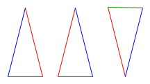
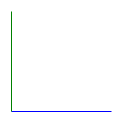
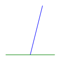
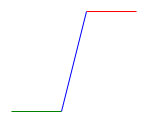
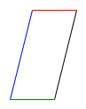
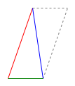

# Symmetry

What do you think symmetry means? Come up with your own definition and then read on.

## Defining Symmetry

We can say something is symmetric if it stays the same when we transform it in some way. For example, the triangle below is symmetric when we flip it, but not when we rotate it by 180 degrees. A square, however, is symmetric under both transformations: flipping and rotating by 180 degrees.

## Why Symmetry is Interesting

Symmetry is great for creating art---we've just learned about symmetry in islamic art. It's also great for doing mathematics! 

The kind of thing a mathematician might want to do is prove that all the angles of a triangle add up to 180 degrees. We can easily add up the angles of any one triangle but if we want to know that all triangles are the same in this way---they all have angles that add up to 180 degrees---we need a proof because we cannot measure all individual triangles. (Why not?)

In this worksheet we will work towards proving this fact about triangles.

Back to symmetry. We saw the triangle above is symmetric when we flip it around the y axis. This tells us many things about the triangle:

- the blue and red line have the same length; and
- the angle between the blue and green line is the same as the angle between the green and red line.

Symmetry is all we need to know this!

## Symmetry and Angles

What is the angle between the blue and the green line?

What is the angle between the blue and the green line?

Here we see two angles. We don't know what the individual angles are, but we know what they sum up to. What is it that they sum up to?

Here we have three lines that make two angles: the angle between the green and blue lines, and the angle between the blue and red lines. The green and red line are parallel. What can we tell about the two angles? *Pro tip:* use symmetry.

Here we see a parallelogram. What do the angles inside the parallelogram add up to? How do we know this is the case? *Pro tip:* use symmetry and it might be helpful to extend some of the lines to make the parallelogram look like the previous image.

Congratulations, you have completed your first proof: you have proved the interior angles of the parallelogram sum to ... what do they sum to? You figured it out, not me!

## Triangles

Now let's look at a triangle. Any triangle will do. What shape do we get if we reflect a triangle around one edge? There is an example below. What does this tell us about the sum of the interior angles of a triangle?

What do the interior angles of a triangle sum to?
